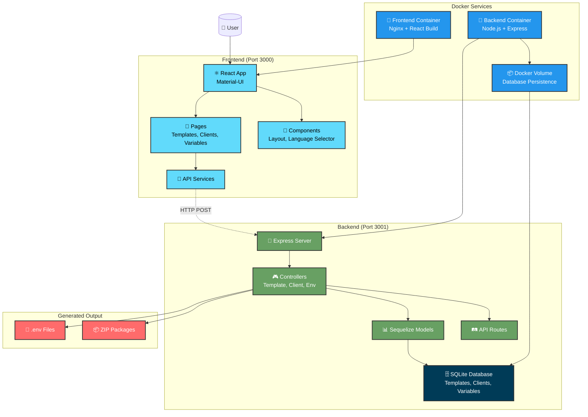

# ENVY

**Environment Variable Yielder** - A modern template management system for generating customized `.env` files and configurations across different clients and environments.

## 📖 Overview

ENVY is a full-stack application designed to streamline environment configuration management. It provides a user-friendly interface to:

- Create and manage configuration templates with typed variables
- Organize clients and their specific configurations
- Generate customized `.env` files based on templates and client-specific variables
- Export configuration packages as ZIP files
- Analyze and validate environment configurations

The system consists of a Node.js/Express backend with SQLite database and a modern React frontend with Material-UI components.

## 🏗️ Architecture



## 🚀 Features

- **Template Management**: Create reusable configuration templates with strongly-typed variables
- **Client Management**: Organize different clients/environments with their specific needs
- **Dynamic Generation**: Generate `.env` files by combining templates with client-specific values
- **Export Functionality**: Package configurations as downloadable ZIP files
- **Analysis Tools**: Validate and analyze environment configurations
- **Modern UI**: Clean, intuitive interface built with Material-UI
- **Type Safety**: Variable typing system for configuration validation

## 📋 Prerequisites

Before running ENVY, make sure you have the following installed:

- **Node.js** (v18 or higher)
- **npm** (v8 or higher)
- **Git** (for cloning the repository)

For Docker setup (optional):

- **Docker** (v20 or higher)
- **Docker Compose** (v2 or higher)

## 🏃‍♂️ Quick Start (Local Development)

### 1. Clone the Repository

```bash
git clone <repository-url>
cd ENVY
```

### 2. Backend Setup

```bash
cd api
npm install
npm start
```

The backend server will start on `http://localhost:3001`

### 3. Frontend Setup

Open a new terminal and navigate to the frontend directory:

```bash
cd react
npm install
npm run dev
```

The frontend development server will start on `http://localhost:3000`

### 4. Access the Application

Open your browser and navigate to `http://localhost:3000` to access the ENVY interface.

### 🚀 Quick Start with Scripts

For convenience, you can use the included utility script:

```bash
# Setup dependencies
./scripts.sh setup

# Start development servers locally
./scripts.sh dev

# Or use Docker for development
./scripts.sh docker-dev

# Reset database (fresh start)
./scripts.sh reset

# Show all available commands
./scripts.sh help
```

## 🐳 Docker Setup

For a containerized setup, use Docker Compose to run both services:

### 1. Build and Start Services

```bash
docker-compose up --build
```

This will:

- Build the backend Docker image
- Build the frontend Docker image
- Start both services with proper networking
- Make the application available at `http://localhost:3000`

### 2. Development Mode

For development with hot-reload:

```bash
docker-compose -f docker-compose.yml -f docker-compose.dev.yml up --build
```

### 3. Production Mode

```bash
docker-compose -f docker-compose.prod.yml up --build -d
```

### 4. Stop Services

```bash
docker-compose down
```

### 5. Database Management

**Important**: Docker containers use **isolated databases** that don't interfere with your local development database.

```bash
# Reset database (fresh start)
./scripts.sh reset

# Clean all Docker resources
./scripts.sh clean

# Each Docker mode has its own database:
# - Standard: envy-database
# - Development: envy-database-dev
# - Production: envy-database-prod
```

## 🛠️ Development

### Project Structure

```
ENVY/
├── api/                    # Backend Node.js application
│   ├── config/            # Database configuration
│   ├── controllers/       # API controllers
│   ├── models/           # Sequelize models
│   ├── routes/           # Express routes
│   └── server.js         # Main server file
├── react/                 # Frontend React application
│   ├── src/
│   │   ├── components/   # React components
│   │   ├── pages/        # Application pages
│   │   ├── context/      # React contexts
│   │   └── services/     # API services
│   └── public/           # Static assets
└── docker-compose.yml    # Docker orchestration
```

### Backend API Endpoints

All API endpoints use POST method:

- `POST /template/*` - Template management
- `POST /client/*` - Client management
- `POST /client-variable/*` - Client variable management
- `POST /generate-env` - Generate .env files
- `POST /export-zip` - Export ZIP packages
- `POST /health` - Health check

### Database

ENVY uses SQLite as its database, which is automatically created and synchronized on first startup. The database file is located at `api/database.sqlite`.

### Environment Variables

#### Backend (.env in /api directory)

```bash
PORT=3001                 # Backend server port
NODE_ENV=development      # Environment mode
```

#### Frontend (.env in /react directory)

```bash
VITE_API_URL=http://localhost:3001  # Backend API URL
```

## 🧪 Testing

### Backend Tests

```bash
cd api
npm test
```

### Frontend Tests

```bash
cd react
npm test
```

## 🚀 Production Deployment

### Local Build

1. Build the frontend:

```bash
cd react
npm run build
```

2. Start the backend in production mode:

```bash
cd api
NODE_ENV=production npm start
```

### Docker Production

```bash
docker-compose -f docker-compose.prod.yml up --build -d
```

## 🤝 Contributing

We welcome contributions to ENVY! Here's how you can help:

### Getting Started

1. Fork the repository
2. Create a feature branch: `git checkout -b feature/amazing-feature`
3. Make your changes and commit them: `git commit -m 'Add amazing feature'`
4. Push to the branch: `git push origin feature/amazing-feature`
5. Open a Pull Request

### Guidelines

- **Code Style**: Follow existing code conventions
- **Testing**: Add tests for new features
- **Documentation**: Update documentation for any new functionality
- **Commit Messages**: Use clear, descriptive commit messages
- **Pull Requests**: Provide detailed descriptions of your changes

### Development Setup for Contributors

1. Follow the local development setup above
2. Install development dependencies
3. Run linters and tests before committing
4. Ensure both frontend and backend work correctly

### Reporting Issues

- Use GitHub Issues to report bugs or suggest features
- Provide detailed reproduction steps for bugs
- Include environment information (OS, Node version, etc.)

## 📄 License

This project is licensed under the MIT License - see the [LICENSE](LICENSE) file for details.

```
MIT License

Copyright (c) 2024 ENVY Contributors

Permission is hereby granted, free of charge, to any person obtaining a copy
of this software and associated documentation files (the "Software"), to deal
in the Software without restriction, including without limitation the rights
to use, copy, modify, merge, publish, distribute, sublicense, and/or sell
copies of the Software, and to permit persons to whom the Software is
furnished to do so, subject to the following conditions:

The above copyright notice and this permission notice shall be included in all
copies or substantial portions of the Software.

THE SOFTWARE IS PROVIDED "AS IS", WITHOUT WARRANTY OF ANY KIND, EXPRESS OR
IMPLIED, INCLUDING BUT NOT LIMITED TO THE WARRANTIES OF MERCHANTABILITY,
FITNESS FOR A PARTICULAR PURPOSE AND NONINFRINGEMENT. IN NO EVENT SHALL THE
AUTHORS OR COPYRIGHT HOLDERS BE LIABLE FOR ANY CLAIM, DAMAGES OR OTHER
LIABILITY, WHETHER IN AN ACTION OF CONTRACT, TORT OR OTHERWISE, ARISING FROM,
OUT OF OR IN CONNECTION WITH THE SOFTWARE OR THE USE OR OTHER DEALINGS IN THE
SOFTWARE.
```

## 🙏 Acknowledgments

- Built with [Node.js](https://nodejs.org/) and [Express](https://expressjs.com/)
- Frontend powered by [React](https://reactjs.org/) and [Material-UI](https://mui.com/)
- Database management with [Sequelize](https://sequelize.org/) and [SQLite](https://sqlite.org/)
- Bundled with [Vite](https://vitejs.dev/) for optimal development experience

## 📞 Support

For questions, issues, or contributions, please:

1. Check existing [GitHub Issues](../../issues)
2. Create a new issue with detailed information
3. Join our community discussions

---

Made with ❤️ for developers who value clean environment management.
